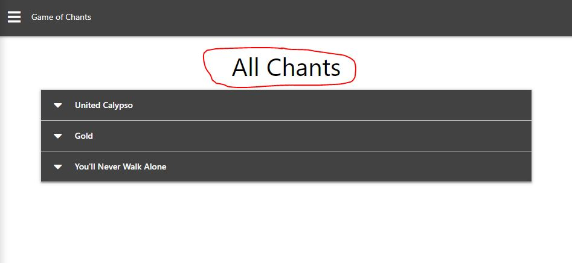
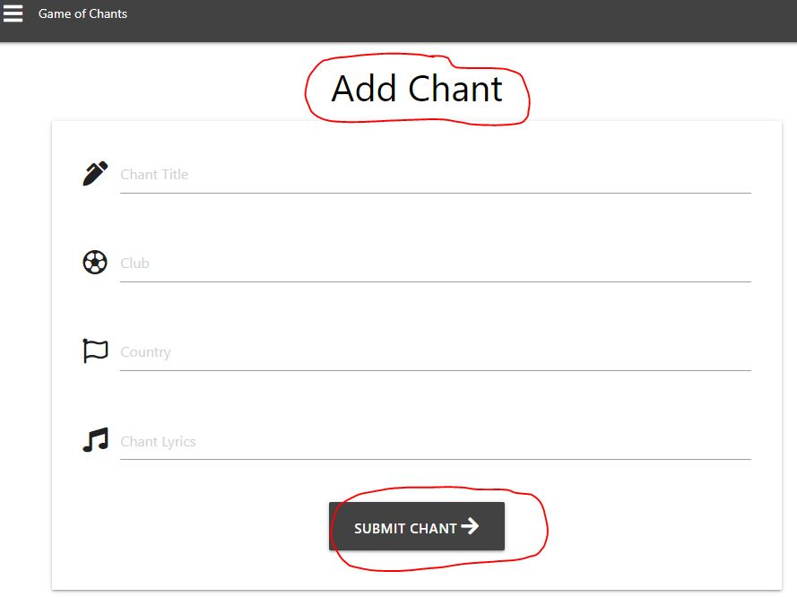
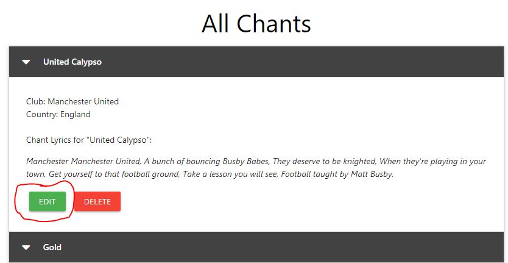
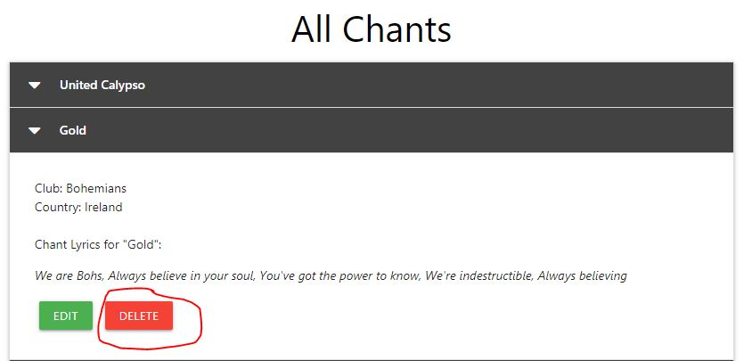
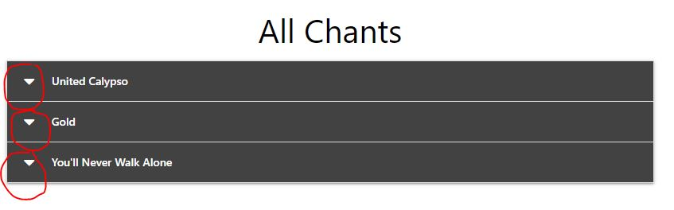
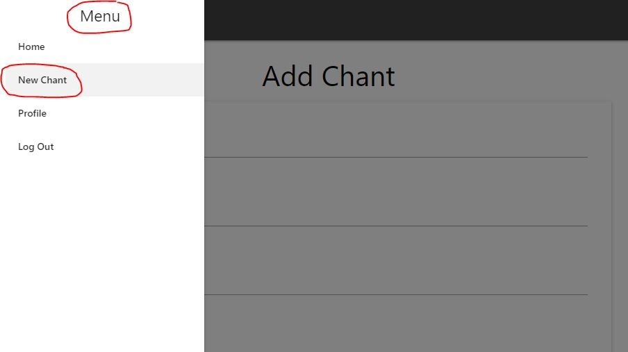
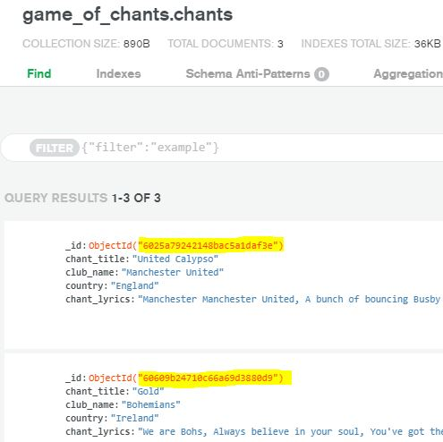
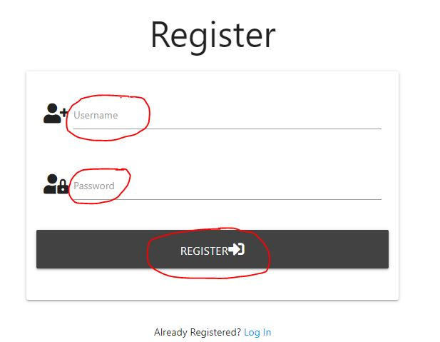

# Football: A Game of Chants

## Introduction and Background
'Football: A Game of Chants' is a fictitious website where football fans can come together and share 
the latest football songs and chants from their own club or clubs around the world. As singing chants
is a big part of football culture for many fans, the site offers a useful outlet for enthusiasts to
discover what songs are synonymous from which clubs in various countries.
As part of MS3 requiremets in the Code Institute, the site offers full CRUD operations, demonstrated in
both the user authentication and chant upload/read/edit/delete functionality.

The repository and deployed site can be accessed below:
 - [Github repo](https://github.com/RoyoftheRavers/football_game_of_chants)
 - [Live site](https://game-of-chants-project.herokuapp.com/)

## User Experience (UX)
### User Stories

As a football fan, I want to:

1. Discover the title and lyrics of chants/songs from various football clubs
2. Share football chants with other fans around the world
3. Update chants with latest lyrics or chorus changes
4. Delete chants when they are created in error or become irrelevant

As a site owner, I want:

1. A page containing all chants submitted by users with an option to view lyrics
2. A quick and easy method for fans to upload chants
3. A uniquely generated record for each chant
4. A simple method for users to register with

### Wireframes

I used the [Balsamiq] tool to create low-fi prototypes of how the site pages would look. 
This gave a good starting guide as to how various features might appear to the user. Not every feature was 
maintained from the orginal wireframes, such as Search which was deemed not to have sufficient value for the user.

 - [Home Page](wireframes/Home-page(not-logged-in).JPG)
 - [Register](wireframes/Register-Page.JPG)
 - [Log In](wireframes/Log-In.JPG)
 - [Home Page (logged in)](wireframes/Home-page(logged-in).JPG)
 - [New Chant](wireframes/Add-Chant.JPG)
 - [All Chants](wireframes/All-Chants.JPG)

## Features and Testing

Each user story from both the user and site owner perspective was tested as outlined below.

### Football Fan Testing

1. Discover the title and lyrics of chants/songs from various football clubs:

2. Share football chants with other fans around the world

3. Update chants with latest lyrics or chorus changes

4. Delete chants when they are created in error or become irrelevant

### Site Owner Testing

1. A page containing all chants submitted by users with an option to view lyrics

2. A quick and easy method for fans to upload chants

3. A uniquely generated record for each chant

4. A simple method for users to register with

## Future Iterations

Although the main purpose of this site is to demonstrate CRUD operations in a potentially useful real-life site,
there are several additions that could be made to increase the site's UX and popularity. 
 - As the site grows, pagination could be added via Flask so that perhaps only 20 chants could be displayed on each page.
 - As more clubs are added, users could filter by club.
 - As more countries are added, users could filter by country.
 - Links to official football sites could be added.
 - Flag logos could be added to each country using an API or JSON file.
 - A branded logo could increase the site's visual appeal to users. 

## Technologies and Deployment

 - [Balsamiq](https://balsamiq.com/wireframes/) was used for creating initial wireframes.
 - [HTML5](https://html.com/html5/) was used for the element structure of each page on the site.
 - [CSS](https://developer.mozilla.org/en-US/docs/Web/CSS) was used sparingly for custom style elements.
 - [Materialize](https://materializecss.com/) was used as an element design library for a user-friendly experience.
 - [JavaScript](https://www.javascript.com/) and [JQuery](https://code.jquery.com/) were used for adding interaction and responsiveness to elements.
 - [Python](https://www.python.org/) was used in the backend to install packages and run the main app.
 - [Flask](https://flask.palletsprojects.com/en/1.1.x/) was imported for additional functionality such as rendering templates, messaging and redirecting.
 - [Jinja Templating Language](https://palletsprojects.com/p/jinja/) was used to loop over items and add the ability to inherit templates.
 - [MongoDB](https://www.mongodb.com/) was used to store user inputs in clusters in the database.
 - [Gitpod](https://www.gitpod.io) was used for commands in a dev environment, in order to ultimately store the code in Github.
 - [Github](https://github.com/) was used to store the code and assets.
 - [Heroku](https://dashboard.heroku.com/apps) was used to deploy the code to a production environment.

 ### Deployment Security

 For security purposes, environment variables were used via an env.py file in dev and Config Vars in Heroku in production.
 Password hashing was also used in the authentication process for added security.

## Acknowledgements

My mentor Felipe was an excellent help throughout each stage of the process. Code Institute Student Care 
were very helpful and understanding, particulary when difficult issues arose on a number of levels - they made 
the process a lot more manageable. CI Tutor support were very good when needed.
The CI mini-project was very useful in learning the tools needed for this project.